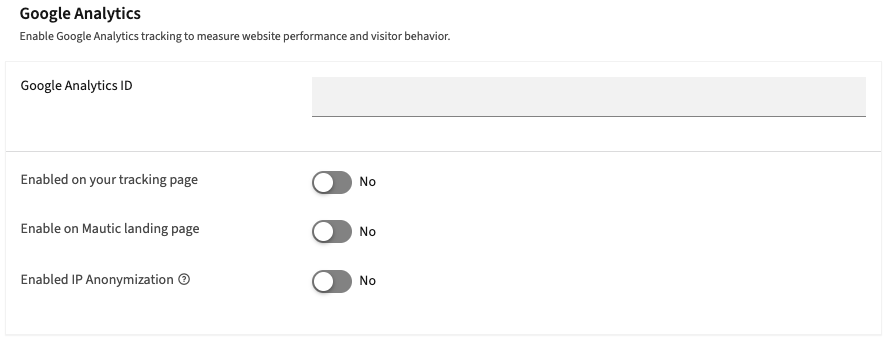

UTM tags overview
#################

.. vale off

UTM - Urchin Tracking Module - parameters are short tags appended to URLs that tell analytics tools where a visitor came from, which Campaign, Channel, source, and so on. Mautic has native support for UTM tags across a wide range of its features, but how UTM data flows through the system isn't uniform. Different features capture, generate, store, and use UTM data in different ways, and confusing them leads to gaps in tracking, empty fields, or misplaced expectations.

.. vale on

Understanding UTM parameters
****************************

The five standard UTM parameters are:

.. vale off

.. list-table::
   :widths: 20, 80
   :header-rows: 1

   * - Parameter
     - Description
   * - **utm_source**
     - The referring source of the web activity. Indicates the social network, search engine, newsletter name, or any other specific source driving the traffic. Examples: ``facebook``, ``twitter``, ``blog``, ``newsletter``
   * - **utm_medium**
     - The Channel or method of delivery. Examples: ``email``, ``cpc``, ``organic_social``, ``organic``, ``social``
   * - **utm_campaign**
     - The specific promotion or marketing initiative title that you want to track. Examples: ``summer_sale``, ``free_trial``, ``spring_sale_2026``
   * - **utm_content**
     - Optional, used to distinguish between multiple versions of the same message or content variant within a Campaign. Examples: ``welcome_email_1``, ``banner_version_a``
   * - **utm_term**
     - Optional, used to track search keywords or content categories. Auto-populated in some contexts.

.. vale on

You don't need to fill all five parameters. Use one, a few, or all as required for your tracking needs.

Using UTM tags in Mautic
************************

To use UTM tags with Google Analytics where they appear in your Google Analytics dashboard, you must install your Google Analytics tracking code on the resource you are linking to. This synchronizes with your Google Analytics dashboard and records the UTM tags.

If you use a Mautic Landing Page, you must go to **Settings** > **Configuration** > **Tracking Settings**, and add your **Google Analytics ID**.

If you use a non-Mautic Landing Page, you must manually embed the Google Analytics tracking script on the third-party Landing Page.

Feature groups
**************

Inbound capture - recording UTM data
====================================

These features read UTM parameters from URLs and save them to a Contact's record. For this to work, the URL the Contact lands on must already contain UTM parameters. Mautic doesn't add them. It only reads what's there. The link that brings the Contact to that Landing Page is always responsible for carrying the UTM values.

.. list-table::
   :header-rows: 1
   :widths: 30, 35, 35

   * - Feature
     - How it triggers
     - Notes
   * - **Form action "Record UTM tags"**
     - Visitor submits a Mautic Form that has this action configured. It reads UTM parameters from the query string of the Landing Page the Form is on, with Landing Page referrer as fallback.
     - See :doc:`utm_tags_forms`
   * - **Tracking script / pixel on external site**
     - The tracking script fires on an external Landing Page. The browser call carries the full Landing Page URL. If it contains UTM parameters, Mautic captures them.
     - See :doc:`utm_tags_landing_pages`
   * - **Mautic Landing Page visit**
     - Someone visits a Landing Page built inside Mautic - ``/Page/slug``. Mautic reads UTM parameters from the URL query string.
     - See :doc:`utm_tags_landing_pages`
   * - **Asset download**
     - On direct Asset download via a UTM-tagged URL, Mautic stores UTM parameters on the download record only, not on the Contact profile. Mautic doesn't capture UTM data when a Form action triggers the download.
     - See :doc:`utm_tags_asset_downloads`

Outbound tagging - appending UTM to links
=========================================

These features take UTM values you configure inside Mautic and automatically stamp them onto every tracked link in the content when it's delivered or rendered. There is nothing to add to the links themselves. You fill in the UTM fields on the content object, and Mautic handles the appending.

.. list-table::
   :header-rows: 1
   :widths: 25, 30, 45

   * - Feature
     - Where you configure UTM
     - How it triggers
   * - **Email**
     - UTM fields on the Email record
     - When you send or preview an Email. Mautic appends the configured UTM parameters to every tracked link in the Email body.
   * - **Dynamic Web Content**
     - UTM fields on the Dynamic Web Content - DWC - block
     - When a DWC block renders for a visitor, either via Campaign or slot-based. Mautic appends UTM parameters to tracked links in the block content at render time.
   * - **Push notifications**
     - UTM fields on the notification
     - When Mautic sends a web or mobile push notification. Mautic appends UTM parameters to tracked URLs inside the notification payload before delivery.
   * - **Focus Items**
     - UTM fields on the Focus Item configuration
     - When a Focus Item displays on a webpage. Mautic appends UTM parameters to tracked links inside the Focus Item content when it renders.

Using UTM data for targeting
============================

Once Mautic captures UTM data on Contact profiles, you can use it to control who Mautic includes in a Segment or how a Contact routes through a Campaign.

.. list-table::
   :header-rows: 1
   :widths: 25, 35, 40

   * - Feature
     - What it does
     - How it triggers
   * - **Segment filters**
     - Includes or excludes Contacts from a Segment based on UTM values ever recorded on them.
     - When Mautic evaluates a Segment. All five UTM fields - ``utm_source``, ``utm_medium``, ``utm_campaign``, ``utm_content``, ``utm_term`` - are available as filter conditions.
   * - **Campaign conditions**
     - Branches Campaign flow based on UTM field values on the Contact.
     - When a Campaign evaluates a "Contact field value" condition node that references a UTM field.

Displaying UTM data
===================

Captured UTM data surfaces in several places for visibility and Reporting.

.. list-table::
   :header-rows: 1
   :widths: 25, 75

   * - Feature
     - What it does
   * - **Contact timeline**
     - Each time Mautic saves UTM tags to a Contact, a timeline entry appears. The icon changes based on ``utm_medium`` - Email, social, ad, Cost Per Click - CPC, and so on. The label uses ``utm_campaign`` if available.
   * - **Reports**
     - A dedicated Report source joins the UTM tags table with Contacts, letting you build Reports filtered or grouped by any UTM field.
   * - **Asset Reports**
     - Asset download Reports expose all five UTM fields.

REST API
========

Two REST endpoints manage UTM data directly on Contacts:

* ``POST /contacts/{id}/utm/add``: accepts the full UTM payload - all five tags, plus ``url``, ``referrer``, and ``User_agent``
* ``POST /contacts/{id}/utm/{utmid}/remove``: removes existing UTM tags from a Contact record

How to understand each group
****************************

The most common source of confusion with Mautic's UTM system is treating all features as equivalent. They aren't:

* **Inbound capture** depends entirely on UTM parameters being in the URL. Mautic reads. It doesn't write.
* **Outbound tagging** is the reverse. Mautic writes UTM parameters onto links, based on what you configured on the content object.
* **Targeting** only works with data that inbound capture already recorded. You can't Segment or branch on UTM data that inbound capture never recorded on the Contact.
* **Asset download UTM data** lives in a separate table and doesn't feed into Contact profiles, Segment filters, or Campaign conditions.

.. seealso::

   * :doc:`utm_tags_landing_pages`
   * :doc:`utm_tags_asset_downloads`
   * :doc:`utm_tags_forms`
   * :doc:`utm_tags_emails`
   * :doc:`utm_tags_dynamic_web_content`
   * :doc:`utm_tags_campaign_conditions`
   * :doc:`utm_tags_segment_filters`
